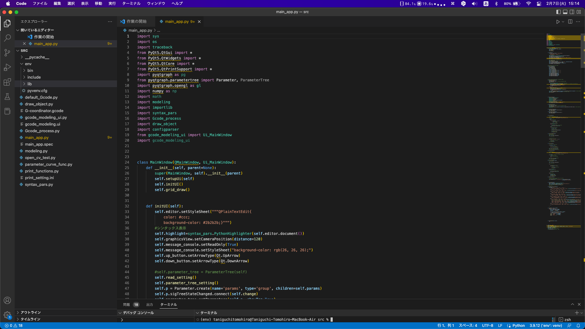
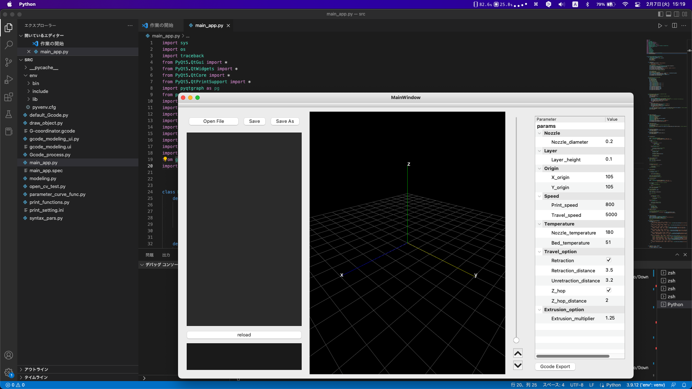
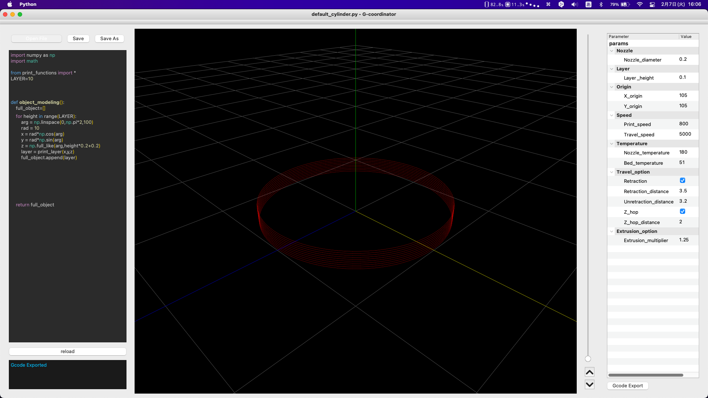

# G-coordinator


# What is G-coordinator?
To use a 3D printer, it is basically necessary to prepare a 3D model, run it through slicing software to create a G-code, and load it into the printer. G-coordinator is an open source software for creating G-codes directly in python.

By creating G-codes directly, you can easily create shapes and forms that would be difficult to achieve using conventional methods of creating 3D models. For example, the following weave shape can be realized.


While Grasshopper in Rhinoceros can do the same thing with visual programming, G-coordinator uses python to achieve the same thing. This allows a high degree of freedom in modeling.

By drawing a python script in the editor on the left and executing it, the nozzle path of the 3D printer is displayed and a preview of the model can be checked. The left side of the screen allows you to adjust various print settings and output G-code.


# Requirements
To use G-coordinator, you need to have a good python environment. Some knowledge of python is also required for modeling.
In the following article, VS-CODE is used, but of course, pycharm and the like are also acceptable.
For the final check of the output G-cocde, software such as prusa-slicer or repetier would be useful.

# G-coordinator installation procedure
This section is intended for those who are not familiar with python, so those who are familiar with python can skip this section.
The source code of G-coordinator is available on github [here](https://github.com/tomohiron907/G-coordinator). (You can download the zip file from the bottom of the green <>code button.) The main code is placed in the src directory, so after downloading and extracting, open the src file with an editor. In this directory, 'main_app.py' is the main pytnon script to be executed.

Then, install the necessary libraries by pip. The necessary items are listed in requiremets.txt.



Download the libraries needed to run the program by typing the following in a terminal.

```pip install numpy```
```pip install pyqt5```
```pip install pyqtgraph```
```pip install pyopengl```
```pip install shaply```

In some cases, you may need to install something that comes standard on a mac, but is not required on a win machine.
If the error disappears and main_app.py is executed, the installation is complete.



# How G-code works

Before modeling, it is useful to understand the structure of a G-code briefly, so that you can model it in the future. The photo below shows a G-code opened in REPETIER.


```G1 F800 X114.97987 Y105.63424 Z2.00000 E0.00589```

These lines are repeated in large numbers.
This is an instruction to push the filament out 0.00589 mm from its current position to position X114.97987 Y105.63424 Z2.00000, moving at a speed of 800 mm per minute.

In other words, when it comes right down to it, there are a total of five elements to be controlled by G-code: three elements of coordinates (x, y, z), speed, and the amount of extrusion. In addition, since speed and extrusion can be determined automatically by the G-coordinator (of course, they can also be specified individually), all that needs to be considered are the coordinates at which the nozzle moves.

# Test modeling (cylinder)
Now, let's start modeling with G-coordinator. First, let's create a cylinder wall as the simplest model.
In the folder downloaded from github, there is a folder named "Example". Open 'default_cylinder.py' in the "example" folder by clicking the "open file" button in the upper left corner.

The code will be displayed in the editor on the left, and when you press the reload button, it will look like the picture below.


In G-coordinator, modeling is done in a function called object_modeling(). As mentioned earlier, what we want is a list of coordinates. Therefore, we create a 3D list that contains the coordinates of the points to be passed through.

The name "full_object" is the name of the 3D list, but the detailed structure of the list will be described in a separate article.
```ruby
def object_modeling():
    full_object=[]
    for height in range(LAYER):
        arg = np.linspace(0, np.pi*2,100)
        rad = 10
        x = rad*np.cos(arg)
        y = rad*np.sin(arg)
        z = np.full_like(arg, height*0.2+0.2)
        layer = print_layer(x,y,z)
        full_object.append(layer)
            

    return full_object
```

The following is a description of what is being done in the function.
First, each layer is iterated using a for statement. The current number of layers is 10, so the function iterates from layer 0 to layer 9.


Next, to draw a circle, the angle (argument) is set in a numpy array in the range of 0 to 2π. The number of elements is set to 100, so exactly 99 regular angles are created.

If we fix the radius at 10, then
The x-coordinate is ```radius * cos(arg)```
The y-coordinate is ```radius * sin(arg)```.
For the z-coordinate in the height direction, an array with the same number of elements as arg is initialized according to the height. 0.2 is added because we want the first layer to print at a height of 0.2, even if the height starts at 0.


```layer = print_layer(x,y,z)```

This line is formatted to add an array of x-coordinates, an array of y-coordinates, and an array of z-coordinates to full_object. The content is similar to np.column_stack(), but F (speed) and E (coefficient of extrusion) can be added as arguments. We plan to write a separate article on this point.
The end point of the nth layer and the start point of the n+1st layer are automatically traveled.
For each layer, a layer is added to the list of full_objects and a full_object is set as the return value.

# Printing settings

Once modeling is complete, prepare the G-code.


At this stage, it is not possible to make such complicated print settings. Only the minimum settings are available.
As you can see, nozzle_diameter is the nozzle diameter and layer_height is the layer height.

The Origin item requires a bit of attention. In general 3D printers, the origin is set to the front left of the bed, but in G-coordinator, the origin is set to the center of the bed to make it easier to write the formula for modeling.
The bed of the 3D printer I am currently using is 210mm x 210mm, so I set the origin at 105mm from the center of the bed.

Coordinates of (10,-20) on the G-coordinator are converted to (115, 85) on the G-code and recorded.

In addition, a speed setting is also provided. The print speed here is the default value when nothing is set, and if the speed is specified in detail in the editor, it takes precedence. The same is true for the bottom item Extrusion_multiplier.

In travel_option, you can set whether or not retraction is used and the z-hop.

In extrusion_multiplier, you can determine the factor by which the extrusion amount (E value) is multiplied.

# Export G-code
When ready, press the Gcode Export button.
When the message "Gcode Exported" appears in the message console in the lower left corner, the process is complete.
A file named G-coordinator.gcode is generated in the src directory of the current directory.


It is recommended to check the generated G-code with other software, just to be sure.

These are the steps to create a G-code with G-coordinator.
We will update the examples and the scripts for them as needed.
